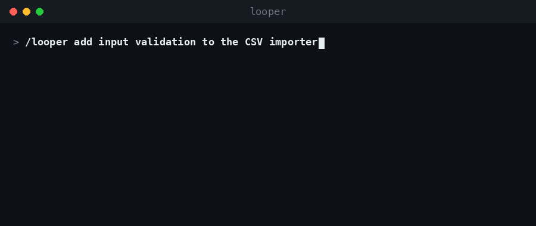

# looper

An autonomous **plan → execute → validate-until-clean** loop skill for [Claude Code](https://docs.anthropic.com/en/docs/claude-code).

`/looper <task>` runs a task through a disciplined loop: an Opus agent plans it (with an explicit validation section, edge-case review, and a read/modify touch list), a Sonnet agent executes it, and a fresh Sonnet validator re-runs every check each iteration until the verdict is clean (up to 10 iterations). It backs up every file before editing it, and a mechanical PreToolUse guard blocks database and infrastructure writes until you explicitly approve them.

It also drives loops whose validation gate is a slow **external** system (CI, cloud eval, remote review): it self-paces re-checks and distinguishes genuine failures from transient infrastructure ones (see Phase 5b in the skill).

## Demo



*Illustrative run: `/looper` plans the task (Opus), clears the permission gate, backs up the files it will touch, executes (Sonnet), then re-validates with a fresh agent each iteration until every check passes.*

## Contents

| Path | What it is |
|------|------------|
| `skills/looper/SKILL.md` | The skill definition (the loop's phases and policies). |
| `hooks/looper-db-guard.py` | PreToolUse(Bash) guard that mechanically blocks DB/infra write commands while a looper task is armed, until approval is recorded. Scoped per (session, task). |

## Install

1. Copy the skill and hook into your Claude Code config:

   ```bash
   mkdir -p ~/.claude/skills ~/.claude/hooks
   cp -r skills/looper ~/.claude/skills/looper
   cp hooks/looper-db-guard.py ~/.claude/hooks/looper-db-guard.py
   chmod +x ~/.claude/hooks/looper-db-guard.py
   ```

2. Register the guard as a `PreToolUse` hook in `~/.claude/settings.json` (merge into any existing `hooks` block):

   ```json
   {
     "hooks": {
       "PreToolUse": [
         {
           "matcher": "Bash",
           "hooks": [
             { "type": "command", "command": "python3 \"$HOME/.claude/hooks/looper-db-guard.py\"" }
           ]
         }
       ]
     }
   }
   ```

   The guard is what makes `looper-guard arm/grant/disarm/status` work. Without it registered, those are no-ops and the mechanical DB/infra protection is inactive (the loop still runs; it just loses the hard guardrail).

3. Restart Claude Code (or start a new session) so the skill and hook are picked up.

## Use

```
/looper <describe the task>
```

The only question the loop will ever ask you is the mandatory permission gate: before it writes to ClickHouse, MySQL, SQLite, or Elasticsearch content, or touches infrastructure (systemd, cron, service restarts, etc.), it stops and asks you to approve exactly what will be modified. Everything else it does autonomously, recording assumptions as it goes.

## How the guard works

While a task is armed (`looper-guard arm <slug>`), the hook inspects every Bash command and denies DB/infra writes (SQL `INSERT/ALTER/DROP/...` via `clickhouse-client`/`mysql`/`sqlite3`, Elasticsearch write requests, `systemctl` start/stop/restart, `crontab` edits) until an approval flag is recorded (`looper-guard grant <slug>`, valid 8 hours, that session only). Reads always pass. Flags live under `~/.claude/looper-approvals/` and are scoped to `(session_id, task-slug)`, so parallel sessions never affect each other. The `looper-guard` tokens are pseudo-commands the hook intercepts; a returned "deny" whose reason starts with `LOOPER-GUARD` means success, not failure.
